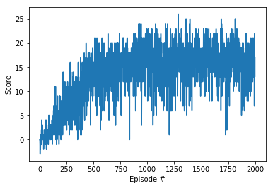
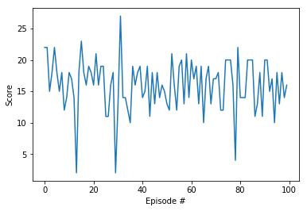
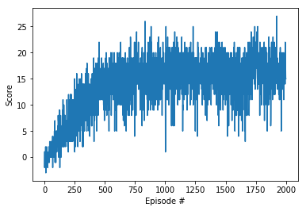
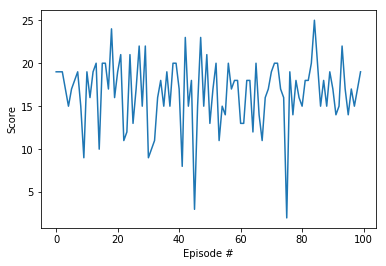

## Methodology

This work implements the [Deep Q Network (DQN)](https://storage.googleapis.com/deepmind-media/dqn/DQNNaturePaper.pdf), where a function approximate the
state space because it’s too costly to make discretization of it.

Deep Neural network represent the mapping Q(s,a). Using Bellman equations we train
the network while we train the parameters to produce the Q values.

## Implementation 

We test 2 structures of network:

DQN_32

  - Fully connected layer - input: 37 (state size) output:32  
  - Fully connected layer - input: 32 output 32  
  - Fully connected layer - input: 32 output: (action size)
  
DQN_64

  - Fully connected layer - input: 37 (state size) output:64  
  - Fully connected layer - input: 64 output 64  
  - Fully connected layer - input: 64 output: (action size)
  

Parameters used in DQN algorithm:

  - Maximum steps per episode: 2000  
  - Starting epsilion: 1.0  
  - Ending epsilion: 0.01  
  - Epsilion decay rate: 0.999
  

## Results 

The agents were able to solve task in less than 600 episodes with pretty similar characteristics:

Model:

 - DQN_32:
    - Convergence: 525 episodes
    - Train Chart    
      
    - Test Chart:
    
      
      
      Average result: 16.05 
      
      
      
- DQN_64:
    - Convergence: 486 episodes
    - Train Chart    
      
    - Test Chart:
    
      
      
      Average result: 15.55  
  
#### Enhancements

Investigation of the hyperparameters such as learning rates and batch sizes.
The task could be completed faster using DQN enhancements such as [dueling networks](https://arxiv.org/abs/1511.06581) and [prioritized experience replay](https://arxiv.org/abs/1511.05952).
  
